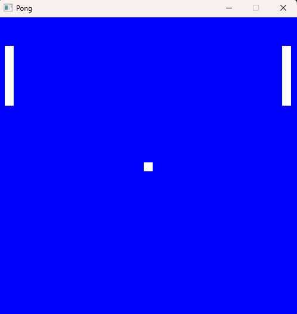

# Pong

I made this game for fun because I was bored one day and wanted to stop using game engines to make my own games, so I took a leap of faith and learned how to make pong.

## Demo
 

All the code is written in C++ and rendering is done with SDL3.
The game does not start till the user presses 1, than the ball will begin to move to the top right of the screen.
The left paddle can be moved with W and S, while the right paddle can move with I and J.
The first play to have the play move off of THEIR SIDE OF THE SCREEN loses.
That my friends is pong.

P.S when a person wins the game the game loop stops and the window will be closed. I did not want to add text rendering to this project.

## How to get Pong on you're system
To play Pong open the CLI and clone `git clone https://github.com/JacobersCom/Pong.git`

Than move into the Pong dir and run this command `cmake -S . -B build -DCMAKE_PREFIX_PATH="C:\Path\to\SDL3"` replace Path\to\SDL3 with the file path to SDL3 on you're system

Than run `cmake --build build` and the exe to play the game will be in `Pong\build\Game\Debug`

Have fun and thank you for playing!!
